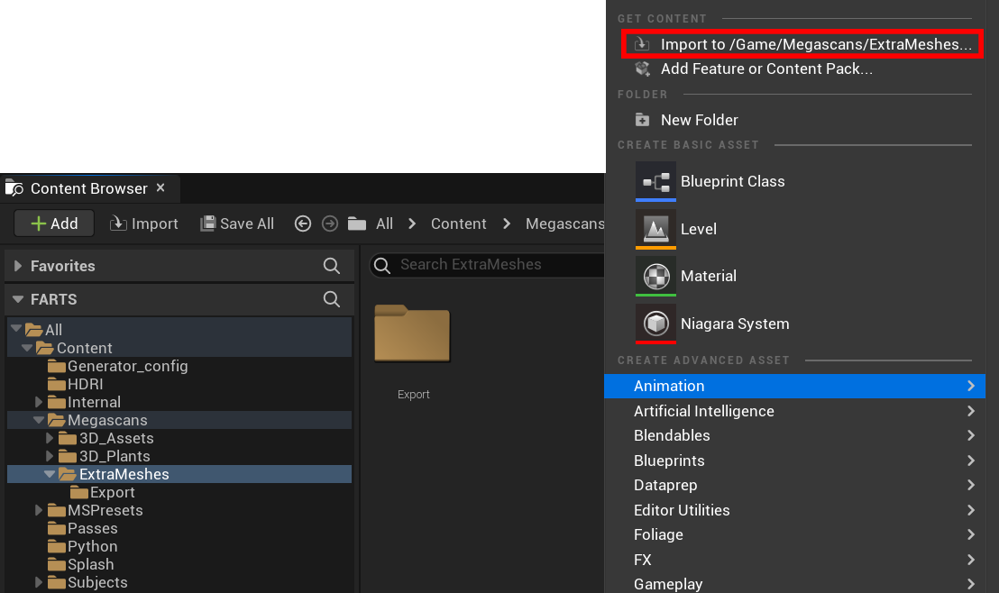
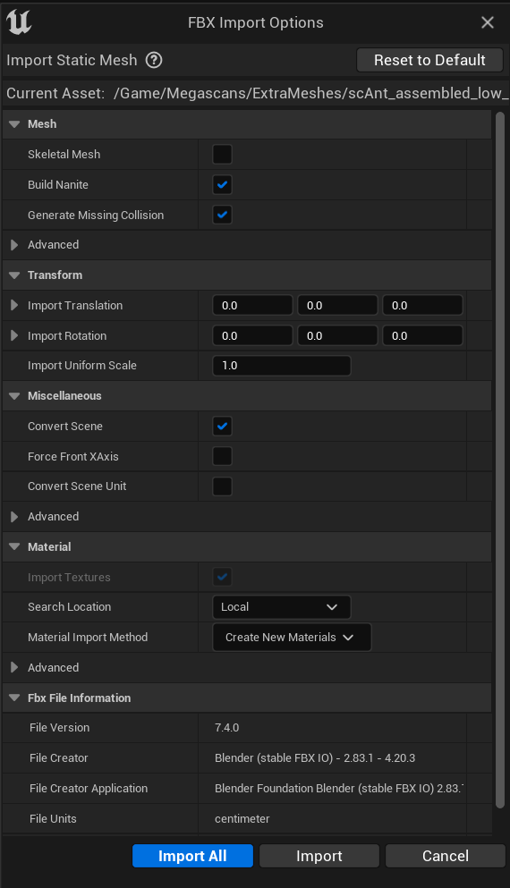
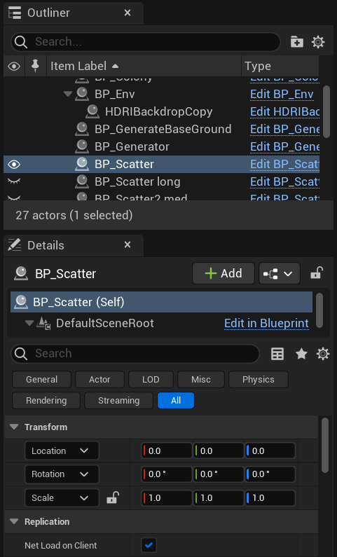
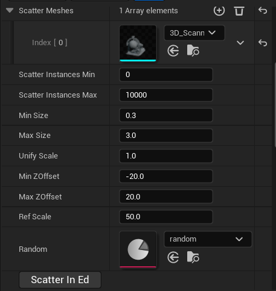
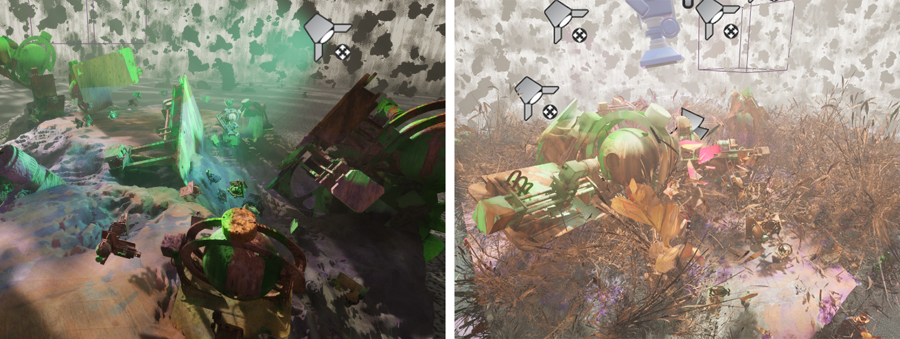

# replicAnt

"generating annotated images of animals in complex environments with Unreal Engine"

by [Fabian **Plum**](https://twitter.com/fabian_plum), 
[René **Bulla**](https://twitter.com/renebulla), 
[Hendrik **Beck**](https://twitter.com/Hendrik_Beck), 
[Natalie **Imirzian**](https://twitter.com/nimirzy), 
and [David **Labonte**](https://twitter.com/EvoBiomech) (2023)

___


___

# Adding custom assets and scatterers

## Requirements:
* Unreal engine (installed via Epic Games Launcher, see above, v5.0.2 or later)
* Completed [generator setup](04_Generating_your_first_dataset.md)

In principle, any 3D asset in a compatible format can be used with the asset scatterers to populate the
generated environments. Here, we will discuss three possible routes of bringing additional 3D assets into
the generator.

* (A) **Direct import**
* (B) **Blender (send2unreal)**
* (C) **Quixel Bridge**

We will also discuss how to add new **asset scatterers**.

___

### (A) Direct import

The most straight forward way to bring your own 3D assets into Unreal is via direct import. In the **Content Browser**, 
simply **right-click** in the folder where you want to load your asset, and select **Import to...**



Then select your asset from your computer and **import** it. That was easy!



___

### (B) Blender (send2unreal)

Similar to the process outlined in [03_Bringing_3D_models_into_Unreal](03_Bringing_3D_models_into_Unreal_guide.md), you
can move any mesh from **Blender** to Unreal.

In **Blender**, when configuring the **Send to Unreal** plugin, instead of the **Subject** directory of the **Unreal** 
project, we import it to **Megascans/ExtraMeshes**. 
This choice is purely for the sake of clarity, and you can store your assets wherever you like, really.


Make sure that all meshes you wish to transfer are placed in the **Export** folder in the **Outliner**.
Apply all transforms.


Then, transfer the assets to Unreal by clicking on **Pipeline/Export/SendToUnreal**.

> **NOTE** : For additional details refer to 
> [03_Bringing_3D_models_into_Unreal](03_Bringing_3D_models_into_Unreal_guide.md)

___

### (C) Quixel Bridge

If you are looking to populate your scenes with assets from the fantastic
[Quixel Megascans](https://quixel.com/megascans/home) library (free to use for
non-commercial Unreal Engine Projects), you can add them to your **Content Browser** directly via the **Quixel Bridge** plugin.

This plugin may not yet be enabled / installed. Despair not. Instead, close the **Unreal Engine Editor** and open the **Epic Games 
Launcher**, and head to your installation of **Unreal Engine**.


Scroll down to the section labeled **VAULT** and type **Bridge** into the search bar.


Install the **Quixel Bridge** Plugin for your version of **Unreal Engine**.


Re-open the **replicAnt.uproject** file.

Now, you can import assets directly from the **Quixel Megascans** library, either via the top bar...


...or within the **Content Browser** (by right-clicking in any of the directories.)


___

## Setting up Asset Scatterers

This process is really rather straight forward. You can either make a copy of one of the **asset scatterers** currently
listed in the **Outliner**, or add a new **asset scatterer** to your scene from the **Content Browser**.

If you decide to add a new asset scatterer, search for the word **scatter** and drag-and-drop the **Blueprint Class**
titled ```BP_Scatter``` into the viewport.


The new asset scatterer should now appear in the **Outliner**.
Make sure to set the **Location** to the world origin (0, 0, 0).



With the newly added ```BP_Scatter``` selected in the **Outliner**, scroll down in the **Details** tab below to
configure the scatterer. 

Add all meshes you want to be spawned by this scatterer (**+**) to the **Array** of **Scatter Meshes**.

* ```Scatter Instances Min / Max``` - Range of elements that are spawned by the **asset scatterer**. One randomly drawn 
element from the **Array** of **Scatter Meshes** will be spawned per iteration.
* ```Min / Max ZOffset``` - Range of units below / above the ground plane in which assets can be spawned.



The effect of the scale-related parameters will depend on your selected assets - click on ```Scatter in Editor``` to
preview the appearance of the scattered meshes in the environment.



___

**Happy Generating!**

___

> In case you encounter any problems, consult our [troubleshooting guide](troubleshooting.md), or consider raising an
> **issue** on the replicAnt GitHub page.
 
## License
© Fabian Plum, Rene Bulla, David Labonte 2023
[MIT License](https://choosealicense.com/licenses/mit/)


